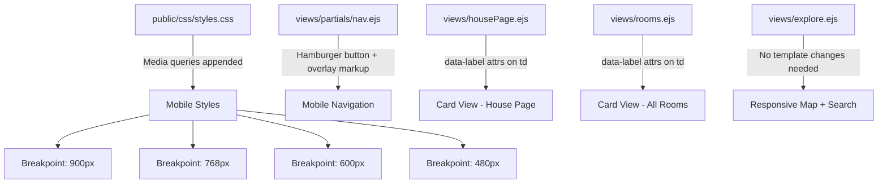

# Design Document: Mobile Responsiveness

## Overview

This design covers making the "Room for Improvement" UChicago housing guide fully responsive on mobile devices (320px–768px). The application is a Node.js/Express server rendering EJS templates with a single global stylesheet (`public/css/styles.css`). The current site has partial responsive support (~40%) with some flexbox/grid usage and three existing breakpoints (900px, 700px, 600px for rankings), but critical components — navigation, data tables, the SVG campus map, filter UIs, word clouds, and preview pills — break or become unusable on small screens.

The implementation strategy is CSS-first: add mobile media queries to the existing stylesheet and make minimal EJS template changes (hamburger menu markup, card view markup). No new npm dependencies are required. The breakpoint system uses four thresholds: 480px, 600px, 768px, and 900px, consistent with the existing 900px and 600px breakpoints already in `styles.css`.

### Design Decisions

1. **CSS-only approach over a framework**: The project uses a single hand-written stylesheet with CSS custom properties. Introducing a responsive framework (Bootstrap, Tailwind) would conflict with the existing glassmorphism design language and require rewriting all templates. Media queries appended to `styles.css` are the lowest-risk path.

2. **Hamburger menu via CSS + vanilla JS**: The nav partial (`views/partials/nav.ejs`) currently renders an inline `<ul>` with no mobile toggle. We'll add a hamburger button element to the EJS template and toggle an `.open` class via a small inline script, matching the project's existing pattern of inline `<script>` blocks in partials.

3. **Card view via CSS display toggling**: Rather than duplicating table markup, we'll use CSS to hide the `<thead>` and restyle `<tr>` elements as stacked cards at ≤768px using `display: block` and `data-label` attributes on `<td>` elements. This requires adding `data-label` attributes in the EJS templates for `housePage.ejs` and `rooms.ejs`.

4. **`!important` only for inline style overrides**: Several EJS templates use inline `style` attributes (explore page search bar, stats row). CSS media queries cannot override inline styles without `!important`. We'll use `!important` exclusively in these cases, as noted in Requirement 17.

## Architecture

The responsive implementation touches three layers of the existing architecture:

### Breakpoint Strategy

| Breakpoint | Scope | Key Changes |
|---|---|---|
| ≤900px | Rankings board | 2-column grid (existing) |
| ≤768px | Primary mobile | Hamburger menu, card view, stacked layouts, touch targets, filter stacking, word cloud single-column, preview pill repositioning, stats row wrapping, inline style overrides |
| ≤600px | Small mobile | Single-column rankings, campus map enlarged labels/targets, single-column dorm grid, legend repositioning |
| ≤480px | Narrow mobile | Reduced banner padding/font sizes, hidden SD sub-labels, full-width landing buttons, body font floor, map header wrapping |

### File Change Summary

| File | Change Type | Description |
|---|---|---|
| `public/css/styles.css` | Append | ~400–500 lines of media query blocks for all 4 breakpoints |
| `views/partials/nav.ejs` | Modify | Add hamburger toggle button, overlay container, toggle script |
| `views/housePage.ejs` | Modify | Add `data-label` attributes to room table `<td>` elements |
| `views/rooms.ejs` | Modify | Add `data-label` attributes to room table `<td>` elements |
| `views/layouts/layout.ejs` | Modify | Add viewport meta tag in `<head>` if missing |
| `views/partials/head.ejs` | Verify | Ensure viewport meta tag exists |

## Components and Interfaces

### 1. Hamburger Menu Component

**Location**: `views/partials/nav.ejs` + CSS in `styles.css`

**Markup additions**:
- A `<button class="hamburger-toggle">` element with three-line icon (CSS-drawn or HTML entity), placed inside `<nav>` before the `<ul>`
- The existing `<ul>` gets an additional class `.nav-links` for targeting
- A `.nav-overlay` backdrop div for click-outside-to-close behavior

**CSS behavior**:
- At ≤768px: `.nav-links` is hidden (`display: none`), hamburger button is visible
- When `.nav-links.open`: displayed as a vertical overlay panel with `position: fixed`, full-width, sliding from top below the header
- Nav search input renders full-width inside the overlay
- Each nav link gets `min-height: 48px` with vertical padding

**JS behavior** (inline script in nav.ejs):
- Toggle `.open` class on hamburger click
- Close on link click, outside click, or Escape key
- Matches existing pattern of inline scripts in the nav partial

### 2. Card View for Room Tables

**Location**: `views/housePage.ejs`, `views/rooms.ejs` + CSS in `styles.css`

**Template changes**:
- Add `data-label="Room"`, `data-label="Dorm"`, etc. attributes to each `<td>` in room table rows
- These attributes are used by CSS `::before` pseudo-elements to render field labels in card view

**CSS behavior at ≤768px**:
- `table thead { display: none; }` — hide column headers
- `table tr { display: block; margin-bottom: 1rem; border-radius: var(--radius-md); box-shadow: var(--shadow-sm); padding: 1rem; }`
- `table td { display: block; padding: 0.5rem 0; }` with `td::before { content: attr(data-label); font-weight: 700; }`
- `.tags-container` within cards gets `max-width: 100%`
- Clickable row behavior preserved via existing `onclick` handlers

### 3. Responsive Campus Map

**Location**: CSS in `styles.css` (no template changes needed)

The SVG already uses `viewBox` and `width: 100%` making it inherently scalable. CSS additions:

- At ≤600px: increase `.dorm-group text` font sizes via CSS `font-size` override on SVG text elements
- At ≤600px: increase tap target area by adding transparent padding rects or increasing the clickable area via CSS `padding` on `.dorm-group`
- At ≤480px: reposition the legend `<g>` elements below the map using CSS transforms or by adjusting the SVG viewBox via a small JS media query listener

**Note**: SVG internal elements have limited CSS styling capability. For label font size increases and legend repositioning at ≤480px, a small JavaScript snippet using `matchMedia` will adjust SVG attributes dynamically, consistent with the existing inline script pattern in `explore.ejs`.

### 4. Touch-Optimized Filter Controls

**Location**: CSS in `styles.css`

At ≤768px:
- `.room-filters` switches to `flex-direction: column`
- Tag buttons get `min-height: 44px`
- Filter dropdown panels get `width: 100%`
- Select elements get `min-height: 44px; font-size: 16px` (prevents iOS zoom)
- Clear button gets `width: 100%` and is placed at the bottom of the stack

### 5. Responsive Word Clouds

**Location**: CSS in `styles.css`

At ≤768px:
- `.word-cloud-row` switches from 2-column to single-column (`flex-direction: column` or `grid-template-columns: 1fr`)
- Word cloud canvas height reduced to `180px`
- `.word-cloud-fallback` displayed as backup with readable font sizes

At ≤480px:
- Fallback word minimum font size: `14px`

### 6. Responsive Preview Pills

**Location**: CSS in `styles.css`

At ≤768px:
- Preview pills switch from `position: absolute` to `position: static` / `display: flex; flex-direction: column`
- Minimum touch target height: `44px`
- House board button: `width: 100%`

At ≤480px:
- Banner padding reduced to `1.5rem`
- House name font size reduced to `1.75rem`

### 7. Global Spacing and Typography

**Location**: CSS in `styles.css`

At ≤768px:
- `main { padding: var(--spacing-xl) 1rem; }`
- `h1 { font-size: 1.75rem; }`
- `.stat-card, .feature-item { padding: 1.25rem; }`
- `footer { padding: 1rem; }`

At ≤480px:
- `body { font-size: 1rem; }` (floor, not reduction)

### 8. Responsive Stats Row

**Location**: CSS in `styles.css`

At ≤768px:
- `.house-stats-row` gets `flex-wrap: wrap !important` (overriding inline `flex-wrap: nowrap`)
- `.house-stat-mini` items wrap into multiple rows
- Inline search form within stats row gets `width: 100%` on its own row via `flex-basis: 100%`

At ≤480px:
- `.house-stat-lbl` font size reduced to `0.65rem`
- `.house-stat-val` font size reduced to `1rem`

### 9. Responsive Rankings Board

**Location**: CSS in `styles.css` (partially exists)

The existing CSS already handles:
- At ≤900px: `#rankings-board` switches to 2-column grid
- At ≤600px: `#rankings-board` switches to single-column

Additional at ≤768px:
- Emblem strip gets `overflow-x: auto` for horizontal scrolling
- `.ranking-scroll` max-height reduced to `320px`

### 10. Responsive Explore Page

**Location**: CSS in `styles.css`

At ≤768px:
- Search bar container switches to `flex-direction: column` so search appears below description text
- Search bar inline styles overridden: `min-width: 0 !important; flex: 1 1 100% !important;`

At ≤600px:
- `.dorm-rankings-grid` switches to single-column (partially exists at 700px, adjusted to 600px)

At ≤480px:
- Map header bar text wraps naturally with `white-space: normal`

### 11. Responsive Room Review Form

**Location**: CSS in `styles.css`

At ≤768px:
- `.sd-strip` radio options get increased gap spacing (minimum 44px between tap targets)
- Form grid (academic year + custom name) switches to single-column via `grid-template-columns: 1fr`
- `.culture-chips .chip-label` gets `min-height: 44px` with centered text
- `.v2-tag-grid` switches to `grid-template-columns: 1fr`

At ≤480px:
- `.sd-sublabel` elements hidden via `display: none`

### 12. Responsive Room Detail Page

**Location**: CSS in `styles.css`

At ≤768px:
- Room detail header (room name + submit review button) switches to `flex-direction: column; align-items: flex-start`
- `.ratings-table td` padding reduced to `0.5rem`
- Ratings table gets `width: 100%`

At ≤480px:
- `.custom-room-name` font size reduced to `2rem` (from `3.2rem`)

### 13. Responsive Landing Page

**Location**: CSS in `styles.css`

At ≤768px:
- `.landing-hero` padding reduced to `2rem 1rem`
- `.landing-hero h1` font size reduced to `1.75rem`
- `.features-grid` switches to single-column layout
- Submit room info panel cascading selects get `width: 100%`

At ≤480px:
- `.landing-buttons` switches to `flex-direction: column` with full-width buttons

### 14. Responsive Authentication Pages

**Location**: CSS in `styles.css`

At ≤480px:
- `.form-container` gets `margin: 0 1rem` instead of auto-centering with fixed max-width

All viewports:
- Form inputs maintain `font-size: 16px` minimum (already set in base styles, prevents iOS zoom)
- Submit buttons get `width: 100%`

### 15. Responsive House Board Page

**Location**: CSS in `styles.css`

At ≤768px:
- `.top-info-section` switches to `flex-direction: column` (trivia + tips stack vertically)
- Chatter bubbles switch to single-column at full container width
- Board identity strip wraps back button below house name via `flex-wrap: wrap`

At ≤480px:
- Chatter bubble text minimum font size: `0.85rem`

### 16. Inline Style Overrides

**Location**: CSS in `styles.css`

At ≤768px, using `!important` to override inline styles in EJS templates:
- Explore search bar: `min-width: 0 !important; flex: 1 1 100% !important;`
- Stats row: `flex-wrap: wrap !important;`
- Search inputs with inline `width:200px`: `width: 100% !important;`
- `!important` is used only when overriding inline styles that cannot be refactored in EJS templates

## Data Models

No data model changes are required. This feature is purely presentational — CSS media queries and minor EJS template markup additions. The server-side routes, data structures, and API endpoints remain unchanged.

## Error Handling

### Graceful Degradation

1. **Word cloud canvas failure**: If the wordcloud2 canvas fails to render on mobile (common on low-memory devices), the existing `.word-cloud-fallback` CSS class displays a static word list. The media queries ensure fallback text is readable at ≥14px on narrow screens.

2. **SVG map interaction**: If JavaScript is disabled, the SVG map's `onclick` handlers won't fire. The map buildings are wrapped in `<g>` elements with `onclick` attributes — this is an existing limitation, not introduced by this feature. The dorm links remain accessible via the search bar and navigation.

3. **Hamburger menu without JS**: If JavaScript fails to load, the hamburger toggle won't work. As a fallback, the CSS will include a `:target` or checkbox-based pure-CSS fallback pattern so navigation links remain accessible.

4. **Inline style override failures**: If a future template change removes the inline styles, the `!important` overrides become no-ops — they won't cause visual regressions since the CSS media query rules provide sensible defaults.

### Touch Target Enforcement

All interactive elements at ≤768px receive minimum 44×44px sizing via CSS. Elements that are structurally smaller (e.g., `.tag` at 32px height in card view) are explicitly documented as exceptions where the reduced size is intentional for information density, while still meeting the 32px minimum noted in Requirement 16.3.

## Testing Strategy

### Why Property-Based Testing Does Not Apply

This feature consists entirely of CSS media queries and minor HTML markup changes for responsive layout. It falls into the "UI rendering and layout" category where property-based testing is not appropriate:

- There are no pure functions with input/output behavior to test
- There are no data transformations, parsers, or serializers
- The changes are declarative CSS rules, not algorithmic logic
- Visual correctness cannot be expressed as universal quantified properties

### Recommended Testing Approach

**1. Manual Visual Testing (Primary)**
- Test each page at 320px, 375px, 480px, 600px, 768px, and 1024px widths using browser DevTools responsive mode
- Verify on real devices: iOS Safari, Android Chrome
- Check each requirement's acceptance criteria visually

**2. Example-Based Automated Tests**
- Use Puppeteer (already a project dependency) to write viewport-based screenshot tests
- For each breakpoint, navigate to key pages and assert:
  - Hamburger menu visibility at ≤768px
  - Card view rendering at ≤768px (check for `display: block` on table rows)
  - Touch target minimum sizes via `getComputedStyle` checks
  - No horizontal overflow (`document.documentElement.scrollWidth <= document.documentElement.clientWidth`)

**3. CSS Validation**
- Validate that all new media queries parse correctly
- Ensure no syntax errors in appended CSS blocks

**4. Accessibility Checks**
- Verify hamburger menu is keyboard-navigable (Enter/Escape)
- Verify ARIA attributes on hamburger toggle (`aria-expanded`, `aria-controls`)
- Verify touch targets meet WCAG 2.5.5 (44×44px minimum)

### Test Matrix

| Page | 320px | 480px | 600px | 768px | 1024px |
|---|---|---|---|---|---|
| Landing (`/`) | ✓ | ✓ | ✓ | ✓ | ✓ |
| Explore (`/explore`) | ✓ | ✓ | ✓ | ✓ | ✓ |
| House Page (`/house/:dorm/:house`) | ✓ | ✓ | ✓ | ✓ | ✓ |
| All Rooms (`/rooms`) | ✓ | ✓ | ✓ | ✓ | ✓ |
| Room Detail (`/room/:id`) | ✓ | ✓ | ✓ | ✓ | ✓ |
| Room Review (`/review/:id`) | ✓ | ✓ | ✓ | ✓ | ✓ |
| Dorm Rankings (`/dorm/:name`) | ✓ | ✓ | ✓ | ✓ | ✓ |
| House Board (`/board/:dorm/:house`) | ✓ | ✓ | ✓ | ✓ | ✓ |
| Login (`/login`) | ✓ | ✓ | ✓ | ✓ | ✓ |
| Register (`/register`) | ✓ | ✓ | ✓ | ✓ | ✓ |
