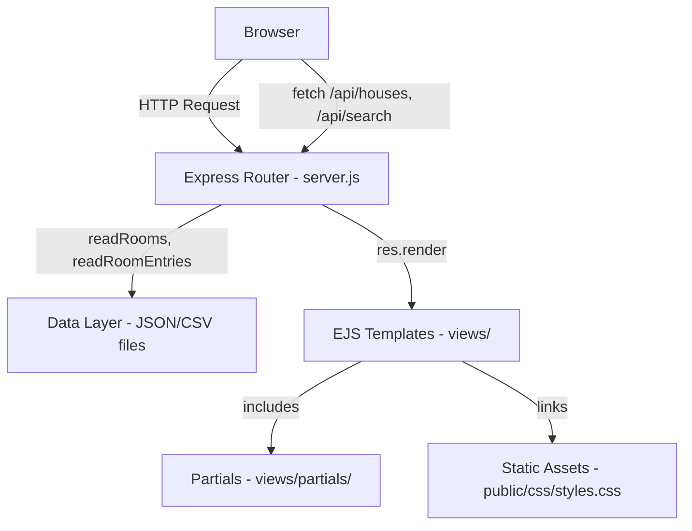

# Design Document: UX Feedback Improvements

## Overview

This design covers 13 UX improvements to the "Room for Improvement" UChicago housing platform. The changes span animation tuning, labeling, visual fixes, new pages, navigation enhancements, and layout refinements — all additive or surgically scoped to avoid breaking existing functionality.

The system is a server-rendered Node.js/Express/EJS application with vanilla CSS and vanilla JavaScript (no build tools, no frontend framework). All UI logic lives in EJS templates with inline `<script>` blocks and a shared `public/css/styles.css`. Data is stored in JSON files and per-building CSV files on disk.

### Design Principles

1. **Non-destructive**: Every change is additive or modifies only the specific elements described. No existing routes, data flows, or client-side behaviors are altered.
2. **No new dependencies**: All changes use existing libraries (wordcloud2.js CDN, vanilla JS, EJS). No new npm packages or build tools.
3. **Progressive enhancement**: New features (search, tooltips, color scales) layer on top of existing markup. If JS fails, the page still renders.
4. **Consistent styling**: New components reuse existing CSS variables, classes, and patterns (glassmorphism cards, pill buttons, toggle switches).

## Architecture

The application follows a simple server-rendered MVC pattern:



### Change Impact Map

| Requirement | Server (server.js) | Views Modified | CSS Modified |
|---|---|---|---|
| R1: Slower Pill Animations | — | housePage.ejs | — |
| R2: Profanity Toggle Label | — | housePage.ejs, rooms.ejs | styles.css |
| R3: Word Cloud Tooltips | — | housePage.ejs | styles.css |
| R4: Stats Bar Visual Fix | — | housePage.ejs, rooms.ejs | styles.css |
| R5: Dorm Filter Dropdown | — | rooms.ejs | styles.css |
| R6: Ratings Table | — | roomDetails.ejs | styles.css |
| R7: Landing Panels (Auth) | — | index.ejs | styles.css |
| R8: Campus Dorm Rankings | New route + handler | New: dormRankingsAll.ejs | styles.css |
| R9: Rating Color Scale | — | roomDetails.ejs, housePage.ejs, rooms.ejs | styles.css |
| R10: Nav Bar Search | New API endpoint | nav.ejs | styles.css |
| R11: Word Cloud Descriptions | — | housePage.ejs | — |
| R12: Landing Page Scroll Fix | — | index.ejs | styles.css |
| R13: Nav Bar Feedback Button | — | nav.ejs | styles.css |
| R14: Non-Regression | — | — | — |

### New Server-Side Components

1. **`GET /dorm-rankings`** — Renders `dormRankingsAll.ejs` with aggregate dorm-level scores computed from existing `computeDormRankings()`.
2. **`GET /api/search?q=`** — Returns JSON array of matching houses and rooms for the nav bar search autocomplete. Reuses `readRooms()` and filters by query string.

## Components and Interfaces

### 1. Preview Pill Animation (R1)

**File**: `views/housePage.ejs` (inline `<script>`)

**Change**: Modify the `setInterval` duration from ~5000ms to 12000ms. Modify the CSS transition durations in `.preview-pill-text.swiping-up` and `.preview-pill-text.visible` from `0.4s` to `0.8s`. The JS rotation logic already uses class toggling (`swiping-up` → `preparing` → `visible`); only timing constants change.

### 2. Profanity Toggle Label (R2)

**Files**: `views/housePage.ejs`, `views/rooms.ejs`, `public/css/styles.css`

**Change**: Add a `<span class="profanity-label">Profanity:</span>` and an info icon (`<span class="profanity-info-icon">ⓘ</span>`) immediately before the existing toggle switch in both pages. The info icon gets a CSS tooltip (`:hover::after` pseudo-element) or a small JS-driven popover explaining the toggle's purpose.

**Interface**:
```html
<div class="profanity-toggle-group">
  <span class="profanity-label">Profanity:</span>
  <span class="profanity-info-icon" tabindex="0" aria-label="Info about profanity toggle">
    ⓘ
    <span class="profanity-tooltip">Toggles visibility of profane language in custom room names and notes...</span>
  </span>
  <label class="toggle-switch">...</label>
</div>
```

### 3. Word Cloud Tooltips (R3)

**File**: `views/housePage.ejs` (inline `<script>`)

**Change**: The existing wordcloud2.js integration uses `WordCloud(canvas, { list: [...] })`. We add the `hover` callback option to wordcloud2.js to detect when a word is hovered. On hover, we:
- Show a positioned tooltip div with the word text and count.
- Scale the hovered word by redrawing or using a CSS overlay.

Since wordcloud2.js provides a `hover` callback `(item, dimension, event)`, we create a floating tooltip `<div>` positioned at the cursor. For the 15% size increase, we overlay a styled `<span>` at the word's bounding box coordinates.

**Interface**:
```javascript
WordCloud(canvas, {
  list: wordList,
  hover: function(item, dimension, event) {
    if (item) {
      showWordCloudTooltip(item[0], item[1], event);
    } else {
      hideWordCloudTooltip();
    }
  }
});
```

### 4. Stats Bar Visual Fix (R4)

**Files**: `views/housePage.ejs`, `views/rooms.ejs`, `public/css/styles.css`

**Change**:
- Override `.house-stats-row` background to `#ffffff` (opaque white).
- Remove `margin-bottom: -2rem` from `.house-banner` on the house page.
- The stats bar retains its existing border, border-radius, box-shadow, and padding.

### 5. Dorm Filter Dropdown (R5)

**File**: `views/rooms.ejs`, `public/css/styles.css`

**Change**: Replace the `<select id="dorm-filter">` with a custom dropdown component styled like the existing `Filter_Tags_Dropdown` on the house page. The dropdown is a button that toggles a positioned `<div>` with dorm names as bold items. Clicking a dorm filters the table and populates the house dropdown. Clicking again deselects. A checkmark SVG indicates the active selection.

**Interface**:
```html
<div class="dorm-filter-dropdown-wrapper">
  <button class="filter-tags-btn" id="dorm-filter-btn">Filter by Dorm ▾</button>
  <div class="filter-tags-dropdown" id="dorm-filter-dropdown">
    <div class="dorm-filter-item" data-dorm="Burton-Judson">
      <span class="dorm-check">✓</span> Burton-Judson
    </div>
    ...
  </div>
</div>
```

### 6. Ratings Table (R6)

**File**: `views/roomDetails.ejs`, `public/css/styles.css`

**Change**: Replace the `<ul class="stat-list">` with a `<table class="ratings-table">` (or CSS grid). Each row has a left-aligned label and a right-aligned value cell. The value cell shows the descriptive label + numeric score in bold. Background color is set per-row using the Rating_Color_Scale.

**Interface**:
```html
<table class="ratings-table">
  <tr style="background-color: #92B89D;">
    <td class="rating-label">Room Size</td>
    <td class="rating-value">Spacious (4/5)</td>
  </tr>
  ...
</table>
```

### 7. Landing Page Panels for Authenticated Users (R7)

**File**: `views/index.ejs`, `public/css/styles.css`

**Change**: Wrap the existing `.features-grid` in an EJS conditional. When `user` is truthy, render five panels instead of three:
1. **Dorm Rankings** — links to `/dorm-rankings`
2. **Campus Map** — links to `/map`
3. **Search Rooms** — links to `/rooms`
4. **Submit Room Info** — contains a mini form with dorm/house/room selectors that navigates to the review page. Uses `/api/houses` to populate options client-side.
5. **Leave Feedback** — button that scrolls to `#feedback-section`.

When `user` is falsy, the existing three panels render unchanged.

### 8. Campus Dorm Rankings Page (R8)

**Files**: `server.js` (new route), new `views/dormRankingsAll.ejs`, `public/css/styles.css`

**Server handler** (`GET /dorm-rankings`):
```javascript
app.get('/dorm-rankings', ensureAuthenticated, (req, res) => {
  readRooms((err, rooms) => {
    const entries = readRoomEntries();
    const dorms = [...new Set(rooms.map(r => r.dorm))];
    const dormScores = dorms.map(dorm => {
      const houseRankings = computeDormRankings(dorm, rooms, entries);
      // Aggregate house scores into a single dorm-level average per category
      const categories = ['culture', 'quietness', 'sunlight', 'roomSize', 'tempControl'];
      const scores = {};
      categories.forEach(cat => {
        const vals = houseRankings.map(h => h.scores[cat]).filter(v => v !== null);
        scores[cat] = vals.length ? vals.reduce((a, b) => a + b, 0) / vals.length : null;
      });
      return { name: dorm, scores, houseCount: houseRankings.length };
    });
    res.render('dormRankingsAll', { user: req.user, dormScores, dormScoresJson: JSON.stringify(dormScores) });
  });
});
```

**View**: A card grid or horizontal bar chart layout. Each dorm is a card showing its name, aggregate scores as colored bars, and a click-through to `/dorm/:dorm`. Visually distinct from the per-dorm house rankings page (which uses a 5-column grid of scrollable lists).

### 9. Rating Color Scale (R9)

**Files**: `views/roomDetails.ejs`, `views/housePage.ejs`, `views/rooms.ejs`, `public/css/styles.css`

**Change**: Define a JS helper function (inline or in a shared partial) and corresponding CSS classes:

```javascript
function ratingColor(val) {
  const colors = { 5: '#34877A', 4: '#92B89D', 3: '#EFE6D1', 2: '#D69772', 1: '#AE5436' };
  return colors[Math.round(val)] || 'transparent';
}
function ratingTextColor(val) {
  return Math.round(val) === 3 ? '#333' : '#fff';
}
```

Apply as inline `background-color` and `color` on rating value elements across all three pages.

### 10. Nav Bar Search (R10)

**Files**: `server.js` (new API endpoint), `views/partials/nav.ejs`, `public/css/styles.css`

**New API endpoint** (`GET /api/search?q=`):
```javascript
app.get('/api/search', ensureAuthenticated, (req, res) => {
  const q = (req.query.q || '').toLowerCase().trim();
  if (!q) return res.json([]);
  readRooms((err, rooms) => {
    if (err) return res.json([]);
    const results = [];
    const seenHouses = new Set();
    rooms.forEach(r => {
      const houseKey = `${r.dorm}::${r.house}`;
      // Match houses
      if (!seenHouses.has(houseKey) && r.house && r.house.toLowerCase().includes(q)) {
        seenHouses.add(houseKey);
        results.push({ type: 'house', name: r.house, dorm: r.dorm, url: `/house/${encodeURIComponent(r.dorm)}/${encodeURIComponent(r.house)}` });
      }
      // Match rooms
      if (r.roomNumber && r.roomNumber.toLowerCase().includes(q)) {
        results.push({ type: 'room', name: `${r.house} ${r.roomNumber}`, dorm: r.dorm, url: `/rooms/${r.id}` });
      }
    });
    res.json(results.slice(0, 20));
  });
});
```

**Nav markup**: Add a search input with a dropdown container between the nav links and Logout. The dropdown is populated via `fetch('/api/search?q=...')` on `input` event with debouncing (300ms). Results show house/room name and dorm. Clicking a result navigates to the URL. Escape or outside click closes the dropdown.

### 11. Word Cloud Descriptions (R11)

**File**: `views/housePage.ejs`

**Change**: Update the existing `<h3>` and `.word-cloud-sub` text in the two word cloud sections:
- Culture Vibes: subtitle → "Selected from a fixed checklist by residents — shows the most commonly chosen descriptors."
- House Descriptors: subtitle → "Written freely by residents — shows the most frequently used words and phrases."

These elements already exist in the template; only the text content changes.

### 12. Landing Page Scroll Fix (R12)

**Files**: `views/index.ejs`, `public/css/styles.css`

**Change**: Reduce `.landing-hero` padding from `6rem 2rem` to `3rem 2rem`. Reduce `h1` font size from `3.5rem` to `2.5rem`. Reduce paragraph bottom margin. All existing content (title, subtitle, buttons) is preserved.

### 13. Nav Bar Feedback Button (R13)

**Files**: `views/partials/nav.ejs`, `public/css/styles.css`

**Change**: Add a "Leave Feedback" link styled as an outlined/accent button in the nav for authenticated users. Order: Logo, Search Bar, Campus Map, All Rooms, Dorm Rankings, Leave Feedback, Logout.

Behavior:
- On the landing page (`path === '/'`): `href="#feedback-section"` with smooth scroll.
- On other pages: `href="/#feedback-section"` which navigates to landing page and the browser scrolls to the anchor.

The feedback form section in `index.ejs` gets an `id="feedback-section"`.

### 14. Non-Regression (R14)

No code changes. Verified by ensuring:
- All existing routes remain in `server.js` with unchanged signatures.
- No existing EJS conditionals or data flows are removed.
- CSS changes are additive (new classes) or override only the specific properties listed.

## Data Models

### Existing Data Models (Unchanged)

**Room** (from colored_rooms.csv):
```
{ id, dorm, house, roomNumber, floor, roomType }
```

**RoomEntry** (from fakeRoomEntries.json):
```
{
  entryId, roomId, userEmail, academicYear, timestamp,
  tags: string[],
  scalars: { "my house has a good culture": number, "my room gets a lot of outside noise": number, ... },
  customName: string | null,
  cultureTags: string[]
}
```

**User** (from users.json):
```
{ email, hashedPassword, verified, verificationToken }
```

**Feedback** (from feedback.json):
```
{ id, user, text, date }
```

### New Data Structures (Client-Side / API Only)

**Search Result** (returned by `GET /api/search`):
```typescript
interface SearchResult {
  type: 'house' | 'room';
  name: string;       // e.g., "Coulter" or "Coulter 301"
  dorm: string;       // e.g., "Burton-Judson"
  url: string;        // e.g., "/house/Burton-Judson/Coulter" or "/rooms/burton-judson__coulter__301__f3"
}
```

**Dorm Score** (returned by `GET /dorm-rankings` to the template):
```typescript
interface DormScore {
  name: string;                    // e.g., "Burton-Judson"
  houseCount: number;
  scores: {
    culture: number | null;
    quietness: number | null;
    sunlight: number | null;
    roomSize: number | null;
    tempControl: number | null;
  };
}
```

**Rating Color Map** (client-side constant):
```javascript
const RATING_COLORS = {
  5: { bg: '#34877A', text: '#fff' },
  4: { bg: '#92B89D', text: '#fff' },
  3: { bg: '#EFE6D1', text: '#333' },
  2: { bg: '#D69772', text: '#fff' },
  1: { bg: '#AE5436', text: '#fff' }
};
```

No new server-side data files are created. No existing data schemas are modified.


## Correctness Properties

*A property is a characteristic or behavior that should hold true across all valid executions of a system — essentially, a formal statement about what the system should do. Properties serve as the bridge between human-readable specifications and machine-verifiable correctness guarantees.*

Most of this feature involves UI rendering, CSS changes, and template modifications that are not suitable for property-based testing. However, three areas involve pure computational logic with meaningful input variation:

### Property 1: Rating Color Scale Mapping

*For any* integer rating value in the set {1, 2, 3, 4, 5}, the `ratingColor` function SHALL return the correct background color (`#AE5436` for 1, `#D69772` for 2, `#EFE6D1` for 3, `#92B89D` for 4, `#34877A` for 5) and the correct text color (`#fff` for values 1, 2, 4, 5 and `#333` for value 3).

**Validates: Requirements 6.3, 9.1, 9.2, 9.3**

### Property 2: Dorm Aggregate Score Computation

*For any* set of house ranking objects (each with a `scores` map of category → number|null), the dorm-level aggregate score for each category SHALL equal the arithmetic mean of all non-null house scores in that category, and SHALL be null when all house scores for that category are null.

**Validates: Requirements 8.2**

### Property 3: Search Result Relevance

*For any* non-empty query string `q` and any dataset of rooms, every result returned by the search function SHALL have a `name` (house name or room identifier) that contains `q` as a case-insensitive substring, and the result set SHALL contain no duplicates for house-type results.

**Validates: Requirements 10.2**

## Error Handling

### Search API (`GET /api/search`)
- **Empty query**: Return empty array `[]` immediately (no DB/file read).
- **File read error**: Return empty array `[]` with no 500 error (graceful degradation — the search dropdown simply shows "No results found").
- **Unauthenticated request**: Express middleware redirects to `/` before the handler runs (existing `ensureAuthenticated` pattern).

### Dorm Rankings Page (`GET /dorm-rankings`)
- **File read error**: Return 500 status with generic error message (consistent with existing route handlers).
- **No rooms data**: Render the page with an empty `dormScores` array; the template shows a "No data available" message.
- **Null scores**: The aggregation logic skips null values. If all house scores for a category are null, the dorm score for that category is null, and the template renders "—" instead of a number.

### Word Cloud Tooltips
- **wordcloud2.js hover callback receives null item**: Hide the tooltip (already handled by the `if (item)` guard).
- **Word count is 0 or undefined**: Display "0 responses" in the tooltip.

### Nav Bar Search (Client-Side)
- **Fetch failure** (network error): Catch the error, hide the dropdown, log to console. No user-facing error.
- **Rapid typing**: Debounce at 300ms to avoid excessive API calls. Only the latest request's results are displayed.

### Rating Color Scale
- **Value outside 1-5 range**: Return `transparent` background and default text color. This handles edge cases where data is missing or malformed.
- **Non-integer values**: Round to nearest integer before lookup.

### Landing Page Panels (Authenticated)
- **`/api/houses` fetch failure** in "Submit Room Info" panel: Disable the dorm/house selectors and show a "Could not load data" message inside the panel.

## Testing Strategy

### Unit Tests (Example-Based)

Unit tests cover specific UI behaviors, DOM structure, and integration points. These should be written as example-based tests since they verify concrete scenarios rather than universal properties.

**Key areas for unit tests:**
- **R1**: Verify `setInterval` duration is ≥ 12000ms and CSS transition durations are ≥ 800ms in the template output.
- **R2**: Verify "Profanity:" label and info icon exist in rendered HTML for both housePage and rooms templates.
- **R4**: Verify stats bar has `background: #ffffff` and banner has `margin-bottom: 0`.
- **R5**: Verify dorm filter dropdown renders with all 6 dorms, click toggles selection, outside click closes.
- **R6**: Verify ratings table structure (`<table>` with label/value columns) replaces `<ul class="stat-list">`.
- **R7**: Verify 5 panels render when `user` is truthy, 3 panels when falsy.
- **R8**: Verify `/dorm-rankings` returns 200 for authenticated users, redirects for unauthenticated.
- **R10**: Verify search input exists in nav for authenticated users, absent for unauthenticated.
- **R11**: Verify word cloud titles and subtitles match specified text.
- **R12**: Verify hero padding is reduced.
- **R13**: Verify "Leave Feedback" button exists for authenticated users, absent for unauthenticated. Verify nav element order.
- **R14**: Smoke tests hitting all existing routes to verify 200 responses.

### Property-Based Tests

Property-based tests use a PBT library (e.g., `fast-check` for JavaScript) to verify universal properties across many generated inputs. Each test runs a minimum of 100 iterations.

| Property | Test Description | Tag |
|---|---|---|
| Property 1 | Generate random integers 1-5, verify `ratingColor` and `ratingTextColor` return correct values | Feature: ux-feedback-improvements, Property 1: Rating color scale mapping |
| Property 2 | Generate random arrays of house ranking objects with nullable scores, verify dorm aggregate equals mean of non-null values | Feature: ux-feedback-improvements, Property 2: Dorm aggregate score computation |
| Property 3 | Generate random query strings and room datasets, verify all search results contain the query as a case-insensitive substring with no duplicate house results | Feature: ux-feedback-improvements, Property 3: Search result relevance |

**PBT Library**: `fast-check` (JavaScript property-based testing library, well-suited for Node.js projects).

**Configuration**: Each property test runs with `{ numRuns: 100 }` minimum.

### Integration / Smoke Tests

- Verify all existing routes return expected status codes.
- Verify authentication guards on new routes (`/dorm-rankings`, `/api/search`).
- Verify form submission flow still works end-to-end.
- Verify client-side filtering on house page and rooms page still functions after CSS/HTML changes.
