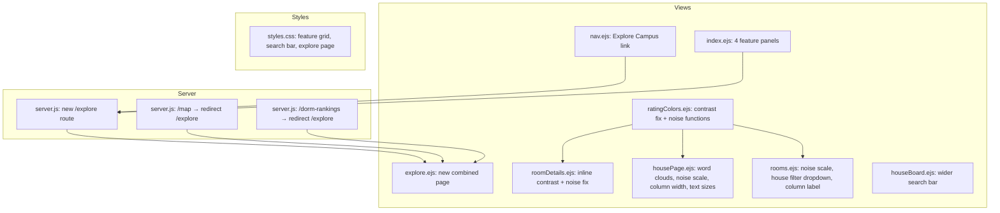

# Design Document: UX Refinements V2

## Overview

This design covers a second round of UX refinements to the "Room for Improvement" UChicago housing platform. The changes span 13 requirements across text contrast fixes, layout adjustments, page consolidation, word cloud rendering upgrades, noise color scale inversion, sentiment-based coloring, and enhanced filtering. All modifications are additive or in-place — no existing data models or core server logic changes.

The platform is a Node.js/Express application using EJS templates, with a single CSS file and JSON/CSV data storage. Changes touch the view layer (EJS templates), one CSS file, the Express route definitions in `server.js`, and a new client-side dependency (d3-cloud).

### Key Design Decisions

1. **Unified `ratingTextColor` function**: Rather than patching contrast in each template independently, we update the shared `ratingTextColor` function in `views/partials/ratingColors.ejs` and all inline copies to return dark text for values 2 and 4 (lighter backgrounds) and white text for values 1, 3→dark, and 5. This single change propagates to all pages that include the partial.

2. **Separate `noiseColor` / `noiseTextColor` functions**: Noise uses an inverted scale (1=green/quiet, 5=red/loud). Rather than adding conditional logic to the existing `ratingColor`, we introduce dedicated `noiseColor` and `noiseTextColor` functions alongside the existing ones. This keeps the code clear and avoids accidental misuse.

3. **Combined Explore Page via new EJS template**: Instead of conditionally rendering map or rankings content in existing templates, we create a new `views/explore.ejs` that includes the map SVG section and the rankings card grid. The old `/map` and `/dorm-rankings` routes become 302 redirects to `/explore`.

4. **D3-Cloud via CDN**: The d3-cloud library will be loaded from a CDN (`<script>` tag) in `housePage.ejs` rather than installed as an npm dependency, since it's a client-side-only library and the project already loads wordcloud2.js via CDN. This avoids build tooling changes.

5. **Sentiment mapping as inline JS object**: Culture vibes come from a fixed checklist, so a predefined sentiment map (word → score 1–5) is embedded directly in the `housePage.ejs` template. For free-text descriptor words, a basic positive/negative word list heuristic is used.

## Architecture

The application follows a simple server-rendered MVC pattern:

```
┌─────────────┐     ┌──────────────┐     ┌─────────────────┐
│  Browser     │────▶│  Express     │────▶│  EJS Templates  │
│  (Client JS) │◀────│  Routes      │◀────│  + Partials     │
└─────────────┘     │  (server.js) │     └─────────────────┘
                    └──────┬───────┘
                           │
                    ┌──────▼───────┐
                    │  JSON / CSV  │
                    │  Data Files  │
                    └──────────────┘
```

### Change Impact Map



### Files Modified

| File | Changes |
|------|---------|
| `server.js` | New `/explore` route, `/map` and `/dorm-rankings` redirects |
| `views/explore.ejs` | **New file** — combined map + rankings page |
| `views/partials/nav.ejs` | Replace "Campus Map" + "Dorm Rankings" with "Explore Campus" |
| `views/partials/ratingColors.ejs` | Fix `ratingTextColor`, add `noiseColor`/`noiseTextColor` |
| `views/index.ejs` | Merge two panels into "Explore Campus", 4-panel grid |
| `views/roomDetails.ejs` | Fix inline `ratingTextColor`, use `noiseColor` for noise row |
| `views/housePage.ejs` | D3-cloud descriptor cloud, sentiment coloring, noise scale inversion, column width, word cloud text sizes |
| `views/rooms.ejs` | Noise scale inversion, "Noise Level" label, house filter dropdown |
| `views/houseBoard.ejs` | Wider nav search bar CSS override |
| `public/css/styles.css` | 4-column feature grid, explore page styles, house board search bar |

## Components and Interfaces

### 1. Rating Color Functions (Shared Partial)

**File**: `views/partials/ratingColors.ejs`

```javascript
// Existing — unchanged
function ratingColor(val) {
  var colors = { 5: '#34877A', 4: '#92B89D', 3: '#EFE6D1', 2: '#D69772', 1: '#AE5436' };
  return colors[Math.round(val)] || 'transparent';
}

// Updated — values 2 and 4 now get dark text for contrast
function ratingTextColor(val) {
  var r = Math.round(val);
  // Dark backgrounds (1, 5) → white; Light backgrounds (2, 3, 4) → dark
  return (r === 1 || r === 5) ? '#fff' : '#1a1a1a';
}

// New — inverted noise scale (1=green/quiet, 5=red/loud)
function noiseColor(val) {
  var colors = { 1: '#34877A', 2: '#92B89D', 3: '#EFE6D1', 4: '#D69772', 5: '#AE5436' };
  return colors[Math.round(val)] || 'transparent';
}

// New — noise text color (same contrast logic)
function noiseTextColor(val) {
  var r = Math.round(val);
  return (r === 1 || r === 5) ? '#fff' : '#1a1a1a';
}
```

**Rationale**: The noise color scale is the *inverse* of the rating color scale. Value 1 (quietest) maps to green (#34877A) and value 5 (loudest) maps to red (#AE5436). This is semantically correct because higher noise is worse. The text color function uses the same contrast logic: white on dark backgrounds (1 and 5), dark on lighter backgrounds (2, 3, 4).

### 2. Combined Explore Page

**Route**: `GET /explore` (authenticated)

The new route merges the data-fetching logic from both `/map` and `/dorm-rankings`:

```javascript
app.get('/explore', ensureAuthenticated, (req, res) => {
  readRooms((err, rooms) => {
    if (err) return res.status(500).send('Error');
    const entries = readRoomEntries();
    
    // Map data
    const dormHousesMap = buildDormHousesMap(rooms);
    const allHouses = [];
    Object.entries(dormHousesMap).forEach(([dorm, houses]) => {
      houses.forEach(house => {
        allHouses.push({
          house, dorm, color: getHouseColor(house),
          initials: house.split(' ').map(w => w[0]).join('').toUpperCase().slice(0, 2),
          emblem: getHouseEmblem(house)
        });
      });
    });

    // Rankings data
    const dorms = [...new Set(rooms.map(r => r.dorm))];
    const dormScores = dorms.map(dorm => {
      const houseRankings = computeDormRankings(dorm, rooms, entries);
      const categories = ['culture', 'quietness', 'sunlight', 'roomSize', 'tempControl'];
      const scores = {};
      categories.forEach(cat => {
        const vals = houseRankings.map(h => h.scores[cat]).filter(v => v !== null);
        scores[cat] = vals.length ? vals.reduce((a, b) => a + b, 0) / vals.length : null;
      });
      return { name: dorm, scores, houseCount: houseRankings.length };
    });

    res.render('explore', {
      user: req.user,
      allHousesJson: JSON.stringify(allHouses),
      dormScores,
      dormScoresJson: JSON.stringify(dormScores)
    });
  });
});

// Redirects
app.get('/map', ensureAuthenticated, (req, res) => res.redirect('/explore'));
app.get('/dorm-rankings', ensureAuthenticated, (req, res) => res.redirect('/explore'));
```

**Template**: `views/explore.ejs` includes:
- The map header, search bar, and SVG campus map from `map.ejs` (without the Quick Access section)
- A divider/heading
- The dorm rankings card grid from `dormRankingsAll.ejs`

### 3. Navigation Bar Update

**File**: `views/partials/nav.ejs`

Replace the two separate links:
```html
<!-- Before -->
<li><a href="/map" ...>Campus Map</a></li>
<li><a href="/rooms" ...>All Rooms</a></li>
<li><a href="/dorm-rankings" ...>Dorm Rankings</a></li>

<!-- After -->
<li><a href="/explore" class="<%= path === '/explore' ? 'active' : '' %>">Explore Campus</a></li>
<li><a href="/rooms" class="<%= path === '/rooms' ? 'active' : '' %>">All Rooms</a></li>
```

Order: Logo → Search Bar → Explore Campus → All Rooms → Leave Feedback → Logout

### 4. Landing Page Feature Panels

**File**: `views/index.ejs`

For authenticated users, reduce from 5 panels to 4:

1. **Explore Campus** (🗺️) → links to `/explore` — replaces separate Dorm Rankings and Campus Map panels
2. **Search Rooms** (🔍) → links to `/rooms`
3. **Submit Room Info** (📝) → contains dorm/house/room selector form
4. **Leave Feedback** (💬) → scrolls to feedback section

CSS grid changes to `repeat(4, 1fr)` for viewports ≥ 1024px.

### 5. Descriptor Word Cloud (D3-Cloud)

**File**: `views/housePage.ejs`

The descriptor word cloud is rewritten from wordcloud2.js to d3-cloud for SVG-based rendering with hover effects:

```javascript
// Load d3 + d3-cloud from CDN
// <script src="https://d3js.org/d3.v7.min.js"></script>
// <script src="https://cdn.jsdelivr.net/npm/d3-cloud@1/build/d3.layout.cloud.min.js"></script>

// Render descriptor cloud
function renderDescriptorCloud(container, wordData) {
  var width = container.clientWidth;
  var height = 180;
  
  var layout = d3.layout.cloud()
    .size([width, height])
    .words(wordData.map(d => ({ text: d.word, size: d.size, count: d.count, sentiment: d.sentiment })))
    .padding(4)
    .rotate(() => 0)
    .fontSize(d => d.size)
    .on("end", draw);
  
  layout.start();
  
  function draw(words) {
    var svg = d3.select(container).append("svg")
      .attr("width", width)
      .attr("height", height);
    
    var g = svg.append("g")
      .attr("transform", "translate(" + width/2 + "," + height/2 + ")");
    
    g.selectAll("text")
      .data(words)
      .enter().append("text")
      .style("font-size", d => d.size + "px")
      .style("fill", d => sentimentColor(d.sentiment))
      .attr("text-anchor", "middle")
      .attr("transform", d => "translate(" + [d.x, d.y] + ")")
      .text(d => d.text)
      .on("mouseover", function(event, d) {
        d3.select(this)
          .transition().duration(200)
          .style("font-size", (d.size * 1.4) + "px");
        showTooltip(event, d);
      })
      .on("mouseout", function(event, d) {
        d3.select(this)
          .transition().duration(200)
          .style("font-size", d.size + "px");
        hideTooltip();
      });
  }
}
```

**Hover behavior**: On mouseover, the word scales up via SVG font-size transition (no re-render). A tooltip shows "[word]: according to [x] students".

### 6. Sentiment Color Mapping

**File**: `views/housePage.ejs` (inline JavaScript)

For the culture word cloud (fixed checklist), a predefined sentiment map:

```javascript
var cultureSentiment = {
  // Positive (green tones)
  'Welcoming': 5, 'Supportive': 5, 'Inclusive': 5, 'Fun': 5,
  'Social': 4, 'Collaborative': 4, 'Friendly': 4, 'Tight-knit': 4,
  'Active': 4, 'Spirited': 4,
  // Neutral (beige)
  'Chill': 3, 'Quiet': 3, 'Independent': 3, 'Studious': 3,
  'Diverse': 3, 'Laid-back': 3,
  // Negative (red/orange tones)
  'Cliquey': 2, 'Exclusive': 2, 'Disconnected': 2, 'Competitive': 2,
  'Loud': 1, 'Unwelcoming': 1, 'Toxic': 1
};

function sentimentColor(score) {
  var colors = { 5: '#34877A', 4: '#92B89D', 3: '#EFE6D1', 2: '#D69772', 1: '#AE5436' };
  return colors[score] || '#EFE6D1';
}
```

For descriptor words (free-text), a basic heuristic using positive/negative word lists:

```javascript
var positiveWords = ['great', 'good', 'nice', 'beautiful', 'clean', 'spacious', 'bright', 'cozy', 'quiet', 'friendly', 'warm', 'comfortable', 'modern', 'amazing', 'love', 'best', 'awesome'];
var negativeWords = ['bad', 'dirty', 'small', 'dark', 'loud', 'noisy', 'cold', 'cramped', 'old', 'broken', 'worst', 'terrible', 'ugly', 'smelly', 'gross'];

function descriptorSentiment(word) {
  var lower = word.toLowerCase();
  if (positiveWords.some(p => lower.includes(p))) return 4;
  if (negativeWords.some(n => lower.includes(n))) return 2;
  return 3; // neutral default
}
```

### 7. House Filter Dropdown (All Rooms Page)

**File**: `views/rooms.ejs`

A new custom dropdown matching the existing dorm filter dropdown style:

- **Button**: "Filter by Houses ▾"
- **Dropdown content**: Houses grouped under bold dorm name headers
- **Behavior**: 
  - If no dorm filter is active, shows all houses grouped by dorm
  - If dorm filter is active, shows only houses within selected dorms
  - Checkmark on selected houses
  - Click to toggle selection
  - Outside click to close
  - Changing dorm filter clears house selections that no longer belong

### 8. House Board Search Bar Widening

**File**: `views/houseBoard.ejs` (scoped CSS) or `public/css/styles.css`

The nav search input width is increased by ~50% on the house board page only. This is achieved with a page-specific CSS class or a scoped `<style>` block:

```css
/* On house board page, widen the nav search bar */
body.page-houseboard .nav-search-input {
  width: 400px; /* ~50% wider than default ~260px */
}
```

The right edge stays approximately the same by adjusting the wrapper positioning.

## Data Models

No data model changes are required. All modifications are in the view/presentation layer and route definitions.

### Existing Data Structures (Unchanged)

**Room Entry** (JSON in `data/fakeRoomEntries.json`):
```json
{
  "entryId": "string",
  "roomId": "string",
  "userEmail": "string",
  "academicYear": "string",
  "timestamp": "ISO 8601",
  "tags": ["string"],
  "scalars": {
    "my house has a good culture": "number (1-5)",
    "my room gets a lot of outside noise": "number (1-5)",
    "room size": "number (1-5)",
    "natural light": "number (1-5)",
    "temperature control": "number (1-5)",
    "culture note": "string",
    "freetext note": "string",
    "house descriptor": "string",
    "form version": "v2"
  },
  "cultureTags": ["string"],
  "customName": "string | null"
}
```

**Room** (derived from CSV):
```json
{
  "id": "string (deterministic slug)",
  "dorm": "string",
  "house": "string",
  "roomNumber": "string",
  "floor": "string",
  "roomType": "string"
}
```

### New Client-Side Data

**Sentiment Map** (inline in `housePage.ejs`): A JavaScript object mapping culture checklist words to sentiment scores (1–5). Not persisted — purely presentational.

**Positive/Negative Word Lists** (inline in `housePage.ejs`): Arrays of common positive and negative descriptor words for the free-text sentiment heuristic. Not persisted.

